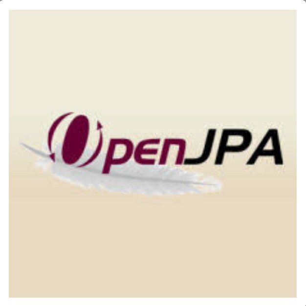

# OpenJPA P6 verslag

Pawel Kubosz, Justin Campell, Xavier Tromp





# Inhoudsopgave

- [Inhoudsopgave](#Inhoudsopgave)


- [Introductie](#Introductie)


- [Geschiedenis](#Geschiedenis)


- [De fabrikanten](#De-fabrikanten)
  - [BEA Systems](#BEA-Systems)
  - [Apache Software Foundation](#Apache-Software-Foundation)


- [Installatie en gebruik](#Installatie-en-gebruik)


- [OpenJPA vergeleken met andere JPA's](#OpenJPA-vergeleken-met-andere-JPAs)
  - [Manier van installatie en configuratie](#Manier-van-installatie-en-configuratie)
  - [Populariteit](#Populariteit)
  - [Documentatie](#Documentatie)
  - [Voordelen ten opzichte van andere JPA's](#Voordelen-ten-opzichte-van-andere-JPAs)
  - [Nadelen ten opzichte van Hibernate](#Nadelen-ten-opzichte-van-Hibernate)

  
## Introductie
OpenJPA is een open source-implementatie van de JPA (Java Persistence API)-specificatie. 
Het is een object-relationele mapping (ORM)-oplossing voor de Java-taal, die het opslaan van objecten in databases vereenvoudigt. 
Het is open-source software die wordt gedistribueerd onder de Apache-licentie 2.0. OpenJPA heeft ook een query-taal genoemd Java Persistence Query Language, of JPQL in het kort.

## Geschiedenis
In 2005 heeft BEA Systems de Kodo geëxpandeerd om een implementatie te zijn van zowel JDO als JPA. 
Kodo is een Java Data Objects implementatie die in 2001 oorspronkelijk ontwikkeld werd door SolarMetric. 
Dit bedrijf werd in 2005 door BEA Systems gekocht.
In 2006 werd een groot stuk van de Kodo source code aan de Apache Software Foundation gedoneerd onder de naam van OpenJPA.

## De fabrikanten

### BEA Systems
BEA systems Inc. was een bedrijf gespecialiseerd in de infrastructuur van softwareproducten. 
In 2008 is het overgenomen door Oracle Corporation.

### Apache Software Foundation
De Apache Software Foundation is een Amerikaanse non-profitorganisatie, die zich bezighoudt met de ontwikkeling en ondersteuning van open-source softwareprojecten. 
Opgericht in 1999, heeft de Apache Software Foundation (ASF) als doel om hoogwaardige, community-gedreven softwareprojecten te bevorderen en te verspreiden.

## Installatie en gebruik
OpenJPA opereert op een query taal die Java Persistence Query Language heet. Oftewel JPQL in het kort. 
Het is een java gebaseerde API voor het opslaan en ophalen van informatie voor de backend. 

Hoe gebruik je openJPA in IntelliJ:

- ### Stap 1: 

  Het openJPA dependency toevoegen aan jouw project met behulp van het pom.xml als je Maven gebruikt.
  Dit is de dependency die je moet toevoegen:

``` xml
<dependencies>

  <dependency>

    <groupId>org.apache.openjpa</groupId>

    <artifactId>openjpa</artifactId>

    <version>3.2.2</version> <!-- De versie kan variëren afhankelijk van de beschikbare versies -->

  </dependency>

</dependencies>
```

- ### stap 2: 

  Een persistence.xml aanmaken in jouw project in de ‘src/main/recourses/META-INF’ directory. 
Dit bestand wordt gebruikt om de persistentie-eenheid te configureren.

Zo kan een persistence.xml bestand er uit zien:
``` xml

<?xml version="1.0" encoding="UTF-8"?>

<persistence xmlns="http://java.sun.com/xml/ns/persistence"

    xmlns:xsi="http://www.w3.org/2001/XMLSchema-instance"

    xsi:schemaLocation="http://java.sun.com/xml/ns/persistence http://java.sun.com/xml/ns/persistence/persistence\_2\_0.xsd"

    version="2.0">


<persistence-unit name="myPU">

    <provider>org.apache.openjpa.persistence.PersistenceProviderImpl</provider>
    
        <!-- Voeg hier je entiteitsklassen toe, hieronder staan de klasses van het ovChipKaart casus: -->
        
        <class>org.example.Reiziger</class>
        
        <class>org.example.Adres</class>
        
        <class>org.example.OvChipKaart</class>
        
        <class>org.example.Product</class>
        
        <properties>
        
            <!-- Database-verbindingseigenschappen -->
            
            
            <property name="javax.persistence.jdbc.driver" value="org.postgresql.Driver"/>
            
            <property name="javax.persistence.jdbc.url" value="jdbc:postgresql://localhost:5432/ovchip"/>
            
            <property name="javax.persistence.jdbc.user" value="postgres"/>
            
            <property name="javax.persistence.jdbc.password" value="99vm83ks"/>
            
            
            
            <!-- OpenJPA-specifieke eigenschappen -->
            
            <property name="openjpa.ConnectionFactoryName" value="jndi/MyDataSource"/>
            
            <property name="openjpa.Log" value="DefaultLevel=WARN, Runtime=INFO, Tool=INFO, SQL=TRACE"/>
            
            
            
            <!-- Andere JPA-configuratie-opties -->
            
            <property name="openjpa.RuntimeUnenhancedClasses" value="supported" />
            
            <property name="openjpa.jdbc.SynchronizeMappings" value="buildSchema(ForeignKeys=true)" />
            
            
            
        </properties>
    
    </persistence-unit>

</persistence>
```


Na deze stappen kan je openJPA in jouw java code gebruiken. 
Je kan entiteiten aanmaken en er operaties op uitvoeren met het gebruik van de ‘EntityManager’.

In de onderstaande voorbeeldcode moet 'myPersistenceUnit' overeenkomen met de naam van de persistentie-eenheid, die is opgegeven in jouw persistence.xml-bestand. 
Hieronder staat hoe je de CRUD-functies gebruikt met openJPA: 

``` Java
EntityManagerFactory emf = Persistence.createEntityManagerFactory("myPU");
EntityManager em = emf.createEntityManager();

EntityTransaction tx =  em.getTransaction();
tx.begin();


em.persist(reiziger);

em.persist(reiziger2);

Reiziger foundReiziger = em.find(Reiziger.class, 101);
System.out.println(foundReiziger);

Reiziger reizigerToUpdate = em.find(Reiziger.class, 101);
reizigerToUpdate.setGeboortedatum(Date.valueOf("2000-06-21"));
reizigerToUpdate.setTussenvoegsel("van den");
em.merge(reizigerToUpdate);
System.out.println(reizigerToUpdate);
tx.commit();

Reiziger toDelete = em.find(Reiziger.class, reiziger2.getReizerId());
System.out.println(toDelete);
em.remove(toDelete);
tx.commit();

em.close();
emf.close();
```
#


# OpenJPA vergeleken met andere JPA's
####
## Manier van installatie en configuratie
OpenJPA wordt net zoals bijvoorbeeld Hibernate & Eclips Link in een project gezet met behulp van een jar bestand. 
Hiernaast kan je in openJPA configuraties toevoegen met behulp van xml.

## Populariteit
OpenJPA is niet erg populair en heeft maar een kleine community. 
Het heeft een marktaandeel van slechts 0.05%. En de site wordt zelden geupdated.


###
## Documentatie
Het is lastig om bronnen en informatie te vinden over openJPA, omdat het zo weinig gebruikt wordt. 
Op Youtube is er bijna niks over te vinden. En maar weinig websites behandelen OpenJPA. 
Zelfs op Stack Overflow is er weinig informatie. 
De enige website die uitleg geeft over openJPA, is de website van openJPA zelf. 
Als je dit vergelijkt met Hibernate of Eclips Link is openJPA een kleine speler in de markt.

## Voordelen ten opzichte van andere JPA's

- ### Eenvoudig te integreren met Appache-softwarestack:

  OpenJPA is van Appache en is hierdoor makkelijk te integreren met Appache-softwarestacks.


- ### Modulaire structuur:

  OpenJPA heeft een modulaire structuur. 
  Dit betekent dat het uit verschillende componenten bestaat, die onafhankelijk gebruikt kunnen worden. 
  Daardoor kun je ervoor kiezen om alleen die gedeeltes van de bibliotheek te gebruiken die je nodig hebt. 
  Hierdoor heb je geen ongebruikte functies in je project. 
  Hibernate heeft een monolithische structuur, waardoor je soms meer opneemt in je project dan dat je eigenlijk nodig hebt.


- ### Snellere prestaties:

  Vanwege de modulaire structuur, kan OpenJPA sneller en efficiënter werken dan Hibernate.

## Nadelen ten opzichte van Hibernate

- ### Weinig bronnen: 

  Er is niet veel informatie te vinden over OpenJPA, waarschijnlijk omdat het zo weinig gebruikt wordt. 
  Hierdoor is het lastig OpenJPA te leren en om oplossingen te vinden bij de problemen die je tegenkomt.
  Dit in tegenstelling tot Hibernate & EclipseLink. 
  Over deze JPA's is er genoeg informatie te vinden.


- ### Minder integratie met moderne technologieën:

  Hibernate wordt voortdurend verder ontwikkeld, zodat het moderne technologieën (zoals bijvoorbeeld Microservices) kan ondersteunen. 
  Dit integenstelling tot OpenJPA, dat niet vaak geüpdatet wordt.
